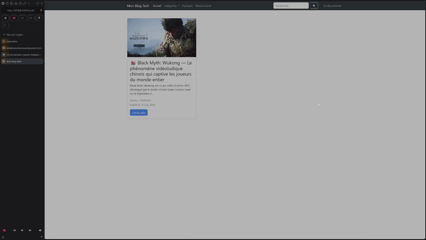

# DocBlog

**DocBlog** est un blog personnel développé avec Django. Son objectif est de centraliser, présenter et partager des contenus variés autour des domaines qui me passionnent : projets open source, hardware, intelligence artificielle, jeux vidéo indépendants et bien plus encore.

Le site est entièrement administré par moi, et les articles sont publiés à un rythme d’environ **un par mois**, afin de garantir un contenu de qualité, soigné et pertinent.

---

## 🛠 Fonctionnalités principales

- 🔍 **Page d’accueil dynamique** avec aperçu des articles
- 🗂 **Classement par catégories** (hardware, IA, open source, etc.)
- 🖼 **Gestion d’images** via l’interface d’administration Django
- 📅 **Dates de publication** et informations sur l’auteur
- 💬 **Système complet de commentaires** avec édition et suppression par l’utilisateur
- 🔐 **Gestion des utilisateurs personnalisée** avec authentification par email
- 🔗 **Navigation fluide** entre articles, catégories et détails
- 💡 **Design responsive** avec Bootstrap

---

## 🧱 Stack technique

- **Backend** : Django 5
- **Base de données** : PostgreSQL
- **Frontend** : HTML5, Bootstrap 5
- **Stockage images** : système de fichiers local via `MEDIA_ROOT`
- **Admin** : Django admin personnalisée pour la gestion des articles et commentaires
- **Authentification** : système utilisateur personnalisé basé sur email
- **Formulaires** : gestion des commentaires et inscription via Django Forms

---

## 📌 Objectifs du blog

> Ce blog n'est pas qu'un exercice technique, mais un espace d'expression sur des sujets concrets.  
> Il vise à :
- Documenter mes projets personnels
- Mettre en avant des initiatives et outils open source utiles
- Partager des réflexions sur l’IA, le hardware, et d’autres technos
- Recommander des jeux indépendants et logiciels méconnus
- Offrir une expérience utilisateur simple et sécurisée via gestion personnalisée des utilisateurs

---

## 🔜 À venir

- 🌐 Mise en production publique
- 🔖 Amélioration du SEO pour un meilleur référencement
- 📊 Analyses de données via la data science pour extraire des insights
- 💡 Partage d’avis et réflexions en mode « data analyst » (sans prétention professionnelle)
- 🔄 Optimisation continue du code et documentation

---

## 👤 Auteur

Développé par **DarkGod**  
> Passionné de tech, dev, jeux et bidouille hardware.  
> Tu peux suivre mes annonces et partages sur [LinkedIn](https://www.linkedin.com/in/mohammad-qassem-belabbas/).

---

## 📷 Aperçu

---

## 📚 Documentation rapide

- **Modèles** : Article, Category, Comment, User (personnalisé)
- **Vues** : affichage articles, détail, ajout/édition/suppression commentaires, inscription, logout
- **Formulaires** : `CommentForm` (commentaires), `RegisterForm` (inscription)
- **Templates** : pages dynamiques basées sur Bootstrap

---

Merci d’avoir lu ! Si tu as des retours ou envies de collaboration, n’hésite pas à me contacter. 🙌
